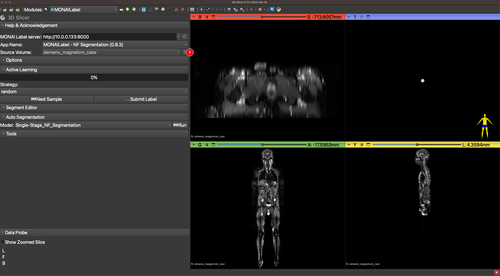
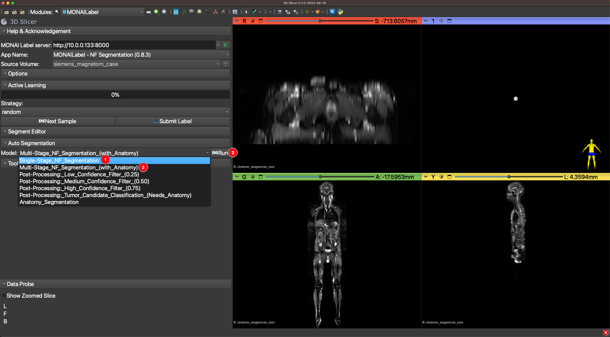
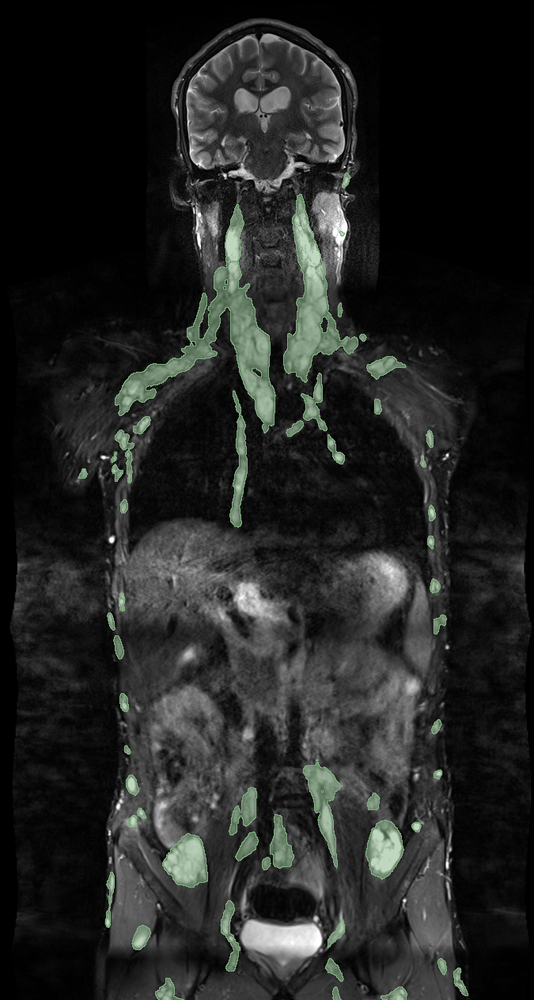
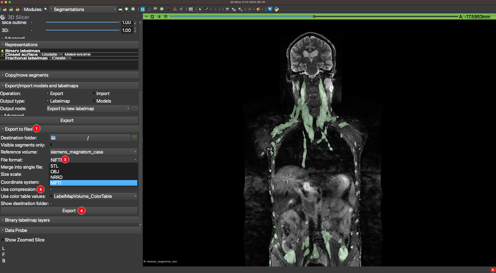

# Neurofibroma Segmentation in Whole-Body MRI

This is the official implementation of the segmentation pipeline from the paper "Anatomy-Informed Deep Learning and Radiomics for Automated Neurofibroma Segmentation in Whole-Body MRI".

Authors: Georgii Kolokolnikov, Marie-Lena Schmallhofer, Lennart Well, Inka Ristow, and René Werner.

---

## Overview

### 1. Motivation
Neurofibromatosis Type 1 (NF1) is a genetic disorder marked by the presence of neurofibromas, benign tumors that can develop throughout the body, often in complex and variable patterns. Accurately segmenting these tumors from whole-body MRI (WB-MRI) scans is essential for clinical management of NF1 patients, including monitoring tumor burden and potential malignant transformation. Traditional methods for neurofibroma segmentation rely on manual annotation, which is time-consuming and introduces variability across clinical evaluations. Additionally, existing fully-automated approaches have shown limited success, especially in handling the diverse morphology and anatomical distribution of neurofibromas (NFs) across body regions​.

This project introduces an anatomy-informed, fully-automated pipeline tailored for NF segmentation in T2-weighted fat-suppressed WB-MRI. By leveraging anatomical context, the pipeline enhances segmentation accuracy, focusing on regions with a high likelihood of NF occurrence. The model’s integration within the 3D Slicer platform allows for clinical usability and facilitates future integration of interactive segmentation workflows for more flexible and efficient NF tumor volume delineation.

The proposed pipeline for automated NF segmentation is depicted below:  


### 2. Functionality
This repository contains the implementation of a fully-automated NF segmentation pipeline for WB-MRI. The implementation uses [MONAI Label](https://github.com/Project-MONAI/MONAILabel) to set up a server that runs on a cluster or a dedicated GPU-equipped machine. The client-side requires using [3D Slicer](https://www.slicer.org/), which connects to the MONAI Label server via the MONAI Label extension.

The pipeline offers multiple segmentation modes:

- **Single-Stage NF Segmentation**: Utilizes a 3D anisotropic U-Net to provide fast, single-stage NF segmentation.
  
- **Multi-Stage NF Segmentation**: This mode represents the primary pipeline from the research paper. It involves:
  1. **Anatomy Segmentation**: Performed using [MRSegmentator](https://github.com/hhaentze/MRSegmentator), which segments anatomical structures and generates a mask. This mask is then processed, including addition of a high-risk zone for NF occurrence around the lungs and spine.
  2. **Ensemble of 3D Anisotropic Anatomy-Informed U-Nets**: Uses anatomical context to enhance segmentation accuracy across distinct anatomical regions.
  3. **Confidence Thresholding**: A default threshold of 0.5 is applied to the segmentation results, balancing sensitivity and specificity.

- **Post-Processing Modes**:
  - **Low Confidence Filter (0.25)**: Applies a threshold of 0.25 to include tumor candidates with lower confidence. This can help reduce false negatives but may increase false positives.
  - **Medium Confidence Filter (0.5)**: Uses the default threshold of 0.5 for a balanced sensitivity and specificity.
  - **High Confidence Filter (0.75)**: Applies a stricter threshold of 0.75, which reduces false positives but may miss some low-confidence true positives.
  - **Tumor Candidate Classification**: This mode uses radiomic features to classify each tumor candidate, when anatomical segmentation has been performed (either within the Multi-Stage NF Segmentation mode or separately). Tumor candidates are first extracted via connected component analysis, and then a random forest classifier categorizes them into tumor and non-tumor based on anatomical localization and extracted radiomic features.

- **Anatomy Segmentation**: This mode, using [MRSegmentator](https://github.com/hhaentze/MRSegmentator), segments anatomical structures and identifies a high-risk zone around the lungs and spine where NFs are most likely to occur.

---

## Installation

### 1. Requirements
#### Hardware
The provided code serves as the backend segmentation logic for the NF segmentation pipeline and should be launched as a MONAI Label server. Ideally, it should be run on a machine equipped with a GPU to enable faster inference. The minimal GPU memory requirement for running the pipeline in a sliding window mode with a batch size of 1 is 8 GB.

#### Software
- **Python**: Version 3.9
- **MONAI Label**: The backend logic for segmentation is based on and follows the structure of the [Radiology Sample App from MONAI Label](https://github.com/Project-MONAI/MONAILabel/tree/main/sample-apps/radiology). The MONAI framework is used extensively for the implementation.
- **MRSegmentator**: The pipeline relies on [MRSegmentator](https://github.com/hhaentze/MRSegmentator) for anatomical segmentation and uses pre-trained weights from MRSegmentator as part of the workflow.
- **nnU-Net**: We use [nnU-Net](https://github.com/MIC-DKFZ/nnUNet) code for parts of the inference logic.
- **PyRadiomics**: [PyRadiomics](https://github.com/AIM-Harvard/pyradiomics) is used for extracting radiomic features in the tumor candidate classification stage.
- The complete list of dependencies required for the pipeline is provided in the `environment.yml` file. 

### 2. Setting Things Up
#### Server-Side
1. **Clone the Repository**
   ```bash
   git clone https://github.com/IPMI-ICNS-UKE/NFSegmentationPipeline.git
   ```

2. **Set Up the Conda Environment**. Create the Conda environment using the `environment.yml` file:
   ```bash
   conda env create -f environment.yml -n nf_segmentation_pipeline
   ```

3. **Download and Set Up Model Weights**. Retrieve the model weights from [Zenodo](https://zenodo.org/records/14035133) and unzip them into the appropriate folder within the repository:
   ```bash
   cd NFSegmentationPipeline/nf_segmentation_app/
   wget https://zenodo.org/record/14035133/files/model.zip
   unzip model.zip
   rm model.zip
   ```

#### Client-Side
To perform neurofibroma segmentation, please, use 3D Slicer. It integrates well with the MONAI Label plugin, allowing to interact seamlessly with the segmentation pipeline.

1. **Install 3D Slicer**. Download and install 3D Slicer from [here](https://www.slicer.org/).
2. **Install the MONAI Label Plugin**. After installing 3D Slicer, add the MONAI Label extension to connect to the segmentation server. Detailed installation instructions are available in the [MONAI Label Plugin for 3D Slicer documentation](https://github.com/Project-MONAI/MONAILabel/tree/main/plugins/slicer).

---

## Usage

### Server-Side

1. **Activate the Conda Environment**
   First, activate the Conda environment created during setup:
   ```bash
   conda activate nf_segmentation_pipeline
   ```
   
1. **Launch the MONAI Label Server**. From the root folder of the repository, start the MONAI Label server by running:
   ```bash
   bash launch_nf_segmentation_server.sh
   ```

2. **Configurable Options**. The `launch_nf_segmentation_server.sh` script can be customized based on your configuration needs:
   - **CUDA_VISIBLE_DEVICES**: Set the integer value corresponding to the NVIDIA GPU you want to use for inference.
   - **Batch Size** (`--conf batch_size`): Controls the batch size for sliding window inference. Minimal batch size is 1 (recommended for GPUs with less than 12 GB memory).
   - **Resample in 2D** (`--conf resample_only_in_2d`): Set to `True` if the slice thickness is larger than 8 mm to perform all resampling operations in 2D in the isotropic plane.
   - **Port** (`--port 8000`):  By default, the MONAI Label server runs on port 8000. If it is occupied, specify a different port.

   For more details about the MONAI Label command-line options, see the [MONAI Label documentation](https://github.com/Project-MONAI/MONAILabel/tree/main?tab=readme-ov-file#step-5-start-monai-label-server-and-start-annotating). 

### Client-Side

The **3D Slicer** application serves as the client for performing neurofibroma segmentation. It can connect to the MONAI Label server either on the same machine or a remote machine accessible over the network.

1. **Launch 3D Slicer**.  
   Open 3D Slicer on the client machine.

2. **Connect to the MONAI Label Server**.  
   Go to the MONAI Label extension and select the appropriate MONAI Label server from the dropdown menu.
   <details>
   <summary>Click to see the illustration</summary>
   <p>
     
   </p>
   </details>

3. **Upload MRI Data**.  
   Drag and drop a whole-body MRI file into 3D Slicer and upload it to the server.
   <details>
   <summary>Click to see the illustration</summary>
   <p>
     
   </p>
   </details>

4. **Choose NF Segmentation Mode**.  
   Select a Neurofibroma segmentation mode from the dropdown menu - either **Single-Stage** or **Multi-Stage** — and start the segmentation process.
   <details>
   <summary>Click to see the illustration</summary>
   <p>
     
   </p>
   </details>

   Depending on the hardware and mode selected, the segmentation process may take 10–120 seconds. The resulting segmentation of neurofibromas will be depcited in green.
   <details>
   <summary>Click to see the illustration</summary>
   <p>
     
   </p>
   </details>

5. **Post-Processing Options**.  
   After segmentation, you can apply post-processing:
   - **Confidence-Based Thresholding**: Choose low (0.25), medium (0.5), or high (0.75) confidence thresholds to filter results.
   - **Tumor Candidate Classification**: Uses radiomic feature extraction and classification based on anatomical localization. This process may take more than 2 minutes, depending on the number of tumor candidates and CPU capabilities.
   <details>
   <summary>Illustration of post-processing effects (Click to Expand)</summary>

   | Low Confidence Filtering | Medium Confidence Filtering | High Confidence Filtering | Tumor Candidate Classification |
   |--------------------------|-----------------------------|---------------------------|--------------------------------|
   |  |  |  |  |

   </details>

6. **Anatomy Segmentation**.  
   The **Anatomy Segmentation** mode uses MRSegmentator to generate an anatomy segmentation mask. This mode is used only for demo purposes.
   <details>
   <summary>Click to see the illustration</summary>
   <p>
     
   </p>
   </details>

7. **Manual Corrections in Segment Editor**.  
   Once NF segmentation is complete, results can be manually adjusted using the Segment Editor. [Learn more about Segment Editor](https://slicer.readthedocs.io/en/latest/user_guide/modules/segmenteditor.html).
   <details>
   <summary>Click to see the illustration</summary>
   <p>
     
   </p>
   </details>

8. **Submit Results**.  
   Submit the segmentation mask back to the server.
   <details>
   <summary>Click to see the illustration</summary>
   <p>
     
   </p>
   </details>

9. **Export Results**.  
   Export the segmentation mask to your local machine in a desired file format.
   <details>
   <summary>Click to see the illustration</summary>
   <p>
     
   </p>
   </details>
   
---
## Tested Configuration

### Tested Data
The pipeline was tested on **T2-weighted fat-suppressed whole-body MRI images** from:
- **Siemens Magnetom** (Siemens Healthineers, Erlangen, Germany)
- **Philips Ingenia** (Best, The Netherlands)

The images were acquired at 1.5T and 3T field strengths and stored in **NIFTI format**. These were anisotropic coronal whole-body MRIs with high resolution in the coronal plane, with an average voxel spacing of **0.625 mm x 0.625 mm x 7.8 mm**.

### Tested Hardware Setup
The pipeline inference was tested on:
- **Machine 1**: 64-bit Ubuntu 22.04.5 LTS with an NVIDIA RTX A6000 GPU.
- **Machine 2**: 64-bit Ubuntu 22.04.4 LTS with an AMD Ryzen 9 7950X3D CPU and an NVIDIA GeForce RTX 4090 GPU.

### Approximate Inference Times
Approximate inference time on the **Machine 2** and batch size = 2:
- **Single-Stage NF Segmentation**: 10 seconds
- **Multi-Stage NF Segmentation (with Anatomy)**: 60 seconds
- **Post-Processing (Low/Medium/High Confidence Filter)**: 1 second
- **Tumor Candidate Classification (Needs Anatomy)**: ~120 seconds per patient with approximately 600 tumor candidates
- **Anatomy Segmentation**: 40 seconds

---

## Contact
For questions, feedback, or collaboration inquiries, please contact:
- **[Georgii Kolokolnikov](mailto:g.kolokolnikov@uke.de)**, PhD student at the University Medical Center Hamburg-Eppendorf (UKE)
- [Institute for Applied Medical Informatics](https://www.uke.de/english/departments-institutes/institutes/applied-medical-informatics/index.html)

For technical issues or feature requests, please open an issue in this repository’s [Issues section](https://github.com/IPMI-ICNS-UKE/NFSegmentationPipeline/issues).
