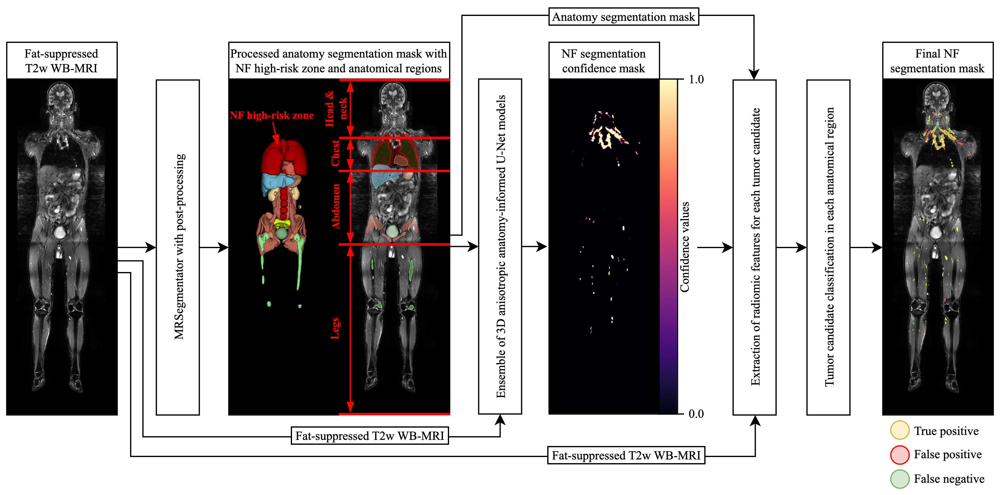
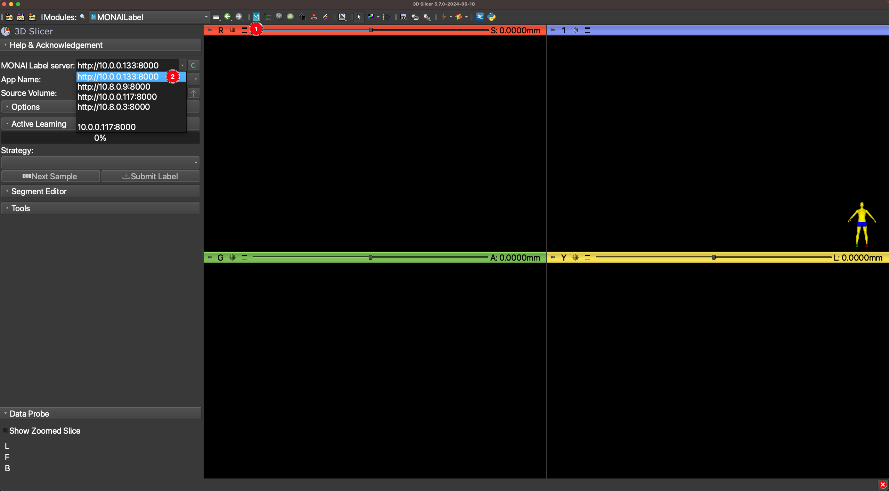
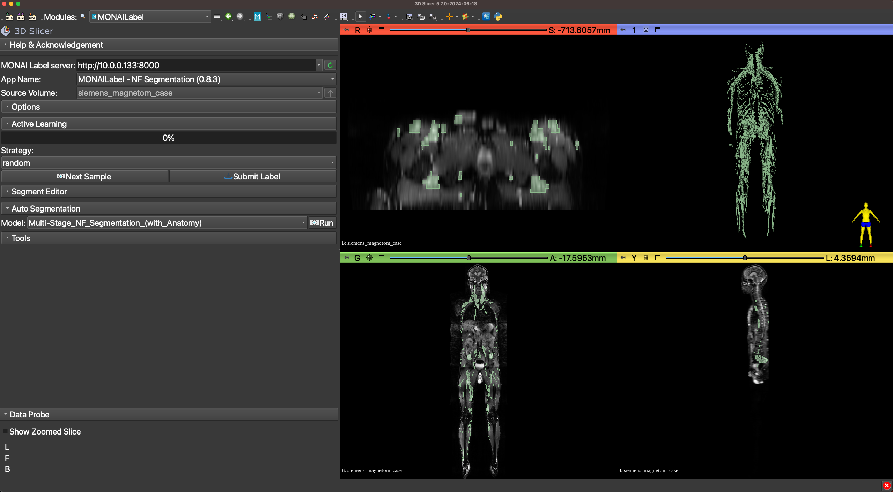
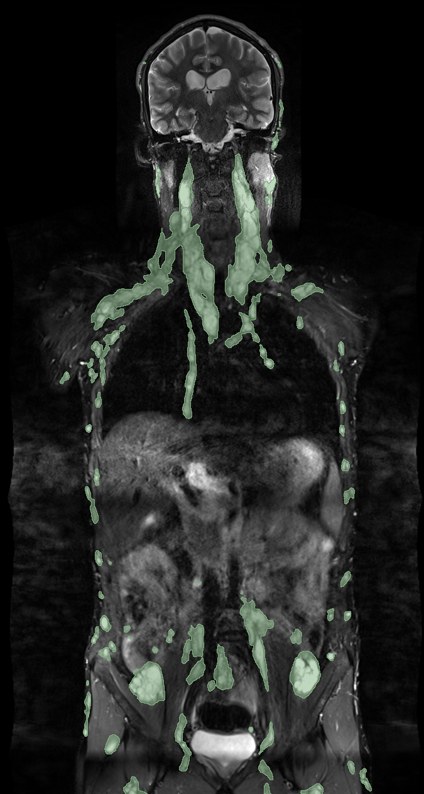
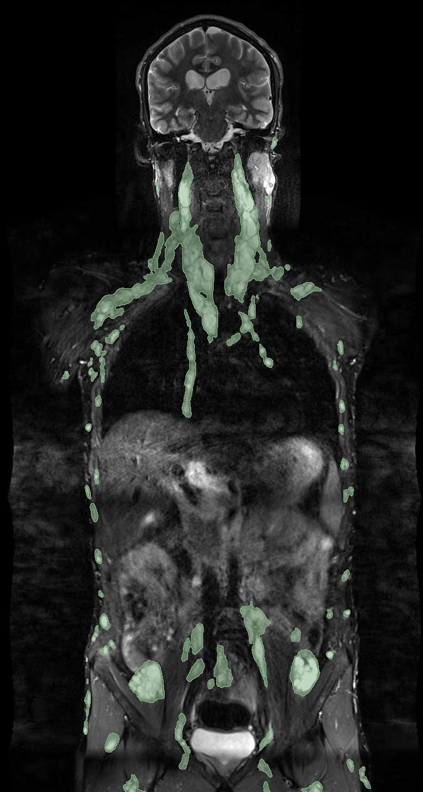
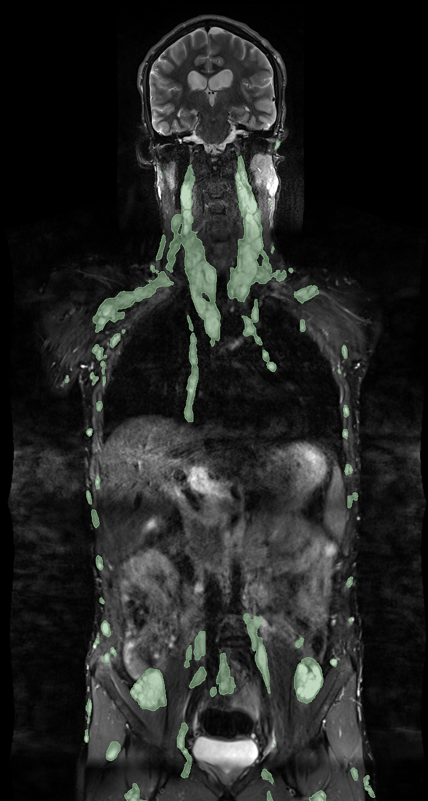
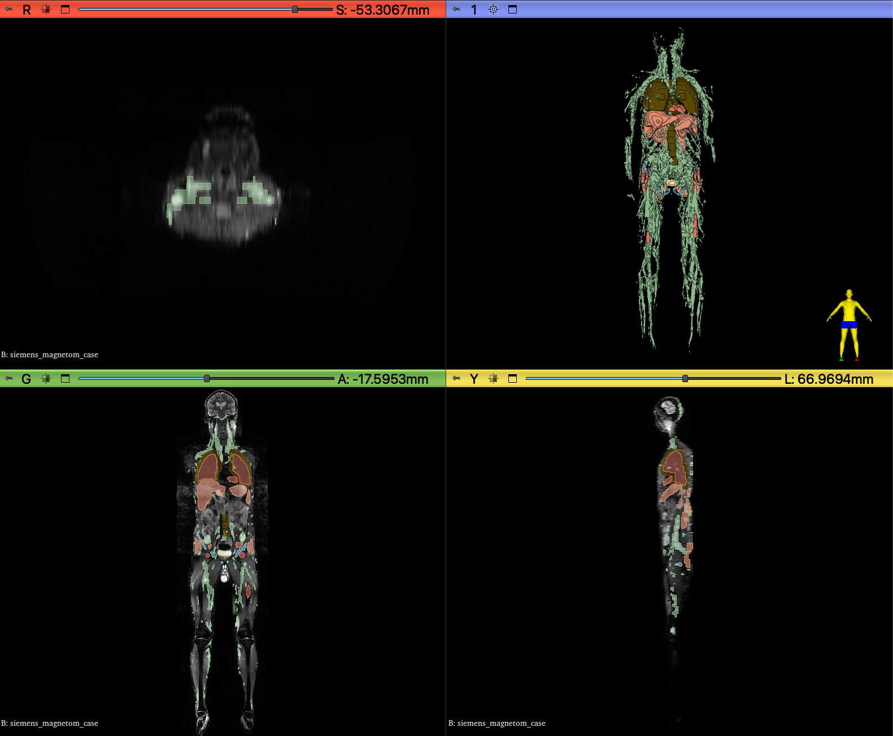
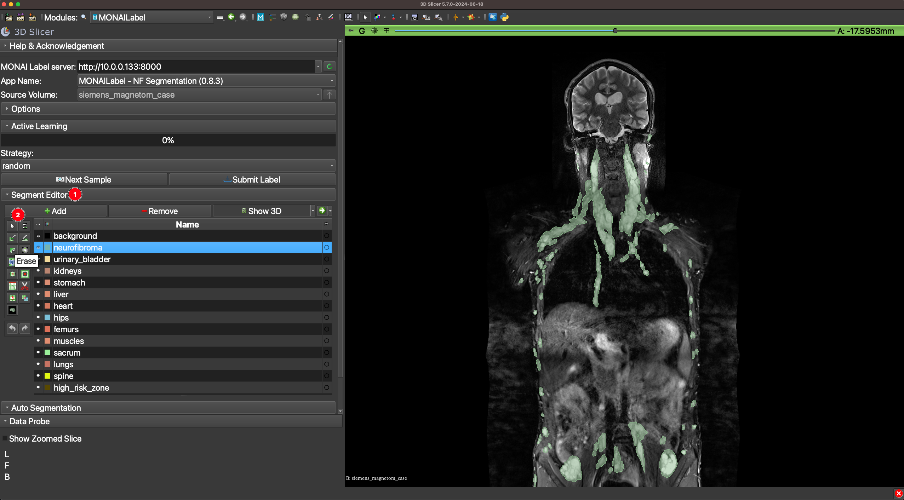
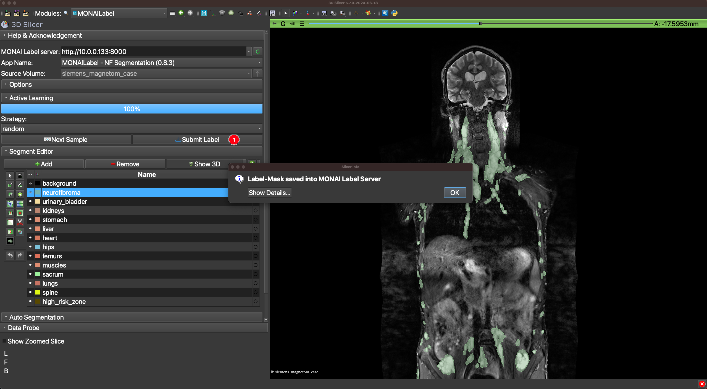

# Automated Neurofibroma Segmentation Pipeline

**Official Implementation of**: *Anatomy-Informed Deep Learning and Radiomics for Automated Neurofibroma Segmentation in Whole-Body MRI*.  

**Authors**: Georgii Kolokolnikov, Marie-Lena Schmallhofer, Lennart Well, Said Farschtschi, Victor-Felix Mautner, Inka Ristow, and René Werner.

---

## Overview

### Motivation
- Neurofibromatosis Type 1 (NF1) is a genetic disorder characterized by neurofibromas. Accurate segmentation in WB-MRI scans is crucial for NF1 patient management, but manual methods are time-consuming and variable. Additionally, existing fully-automated approaches have shown limited success, especially in handling the diverse morphology and anatomical distribution of neurofibromas (NFs) across body regions​.  

- This project presents an automated anatomy-informed pipeline for NF segmentation in T2-weighted fat-suppressed WB-MRI. Inspired by the [Radiology Sample App from MONAI Label](https://github.com/Project-MONAI/MONAILabel/tree/main/sample-apps/radiology), the pipeline integrates seamlessly with [3D Slicer](https://www.slicer.org/), enabling enhanced usability and potential for future extension. 

- The provided code sets up a backend MONAI Label server that performs segmentation logic. It is recommended to be run on a cluster or a dedicated GPU-equipped machine. 3D Slicer can be used on a client side to get access to the backend MONAI Label server.

- The proposed automated anatomy-informed pipeline for NF segmentation is depicted below:  



### Functionality
🎬 [Click here](https://zenodo.org/records/14133129/preview/NF_segmentation_demo.mp4?include_deleted=0) to watch a video demonstration of the NF segmentation pipeline.

The pipeline offers multiple modes:
- **Single-Stage NF Segmentation**: Fast segmentation with a single 3D anisotropic U-Net.
- **Multi-Stage NF Segmentation**: Anatomy-informed segmentation with an ensemble of 3D anisotropic U-Nets.<details>
   <summary>Stages of the pipeline (Click to Expand)</summary>

   1. **Anatomy Segmentation**: Performed using [MRSegmentator](https://github.com/hhaentze/MRSegmentator), which segments anatomical structures and generates a mask. The mask is processed, including addition of a high-risk zone for NF occurrence around the lungs and spine.
   
   2. **Ensemble of 3D Anisotropic Anatomy-Informed U-Nets**: Uses anatomical context to enhance segmentation accuracy across distinct anatomical regions.
   
   3. **Confidence Thresholding**: A default threshold of 0.5 is applied to the segmentation results, balancing sensitivity and specificity.

</details>
  
- **Post-Processing Modes**:
  - **Low / Medium / High Confidence Filtering**: Applies a threshold of 0.25, 0.5, or 0.75 to the predicted segmentation probability mask.
  - **Tumor Candidate Classification**: Uses radiomic features to classify each tumor candidate defined via connected component analysis.

- **Anatomy Segmentation**: Segments anatomical structures  using [MRSegmentator](https://github.com/hhaentze/MRSegmentator), and identifies a high-risk zone around the lungs and spine where NFs are most likely to occur.

---

## Installation

### Requirements
- **Hardware**: GPU recommended (8 GB VRAM min.).
- **Software**: Python 3.9, [MONAI Label](https://github.com/Project-MONAI/MONAILabel), [MRSegmentator](https://github.com/hhaentze/MRSegmentator), [nnU-Net](https://github.com/MIC-DKFZ/nnUNet), [PyRadiomics](https://github.com/AIM-Harvard/pyradiomics). Full list of dependencies in `environment.yml`.

### Setup
#### Server-Side
1. Clone repository and set up environment:
   ```bash
   git clone https://github.com/IPMI-ICNS-UKE/NFSegmentationPipeline.git
   conda env create -f environment.yml -n nf_segmentation_pipeline
   ```

2. Download and set up model weights ([Zenodo](https://zenodo.org/records/14035133)):
   ```bash
   cd NFSegmentationPipeline/nf_segmentation_app/
   wget https://zenodo.org/record/14035133/files/model.zip
   unzip model.zip && rm model.zip
   ```

#### Client-Side
1. Install [3D Slicer](https://www.slicer.org/).
2. Install the MONAI Label Plugin in 3D Slicer following [these instructions](https://github.com/Project-MONAI/MONAILabel/tree/main/plugins/slicer).

---

## Usage
<details>
<summary>Server-side</summary>

1. **Activate environment**:
   ```bash
   conda activate nf_segmentation_pipeline
   ```
2. **Launch MONAI Label Server**:
   ```bash
   bash launch_nf_segmentation_server.sh
   ```
3. **Configurable pipeline options** in `launch_nf_segmentation_server.sh`: 
   - **GPU selection**: `CUDA_VISIBLE_DEVICES=0`.
   - **Sliding window batch size**: `--conf batch_size 2`.
   - **Resample in 2D**: `--conf resample_only_in_2d True`
   - **Port**: `--port 8000`.

[Click here](https://github.com/Project-MONAI/MONAILabel/tree/main?tab=readme-ov-file#step-5-start-monai-label-server-and-start-annotating) for more MONAI Label command-line options.
</details>

<details>
<summary>Client-side</summary>

1. Launch 3D Slicer and connect to the MONAI Label server. <details> <summary>Expand for visual instructions</summary>
   <p>
     
   </p>
   </details>
2. Upload MRI data to the MONAI Label server. <details> <summary>Expand for visual instructions</summary>
   <p>
     
   </p>
   </details>
3. Select NF segmentation mode (Single-Stage or Multi-Stage). <details> <summary>Expand for visual instructions</summary>
   <p>
     
   </p>
   </details>

   <details> <summary>Expand to see an example of the NF segmentation</summary>
   <p>
     
   </p>
   </details>
4. Apply post-processing (confidence filtering or tumor candidate classification). <details> <summary>Expand for visual comparison of post-processing effects</summary>

   | Low Confidence Filtering | Medium Confidence Filtering | High Confidence Filtering | Tumor Candidate Classification |
   |--------------------------|-----------------------------|---------------------------|--------------------------------|
   |  |  |  |  |
   </details>

5. Optional: Apply Anatomy Segmentation to generate and show an anatomy segmentation mask. <details> <summary>Expand to see an example of the processed anatomy segmentation</summary>
   <p>
     
   </p>
   </details>
   
6. Optional: Use Segment Editor for manual adjustments. [Learn more about Segment Editor](https://slicer.readthedocs.io/en/latest/user_guide/modules/segmenteditor.html). <details> <summary>Expand for visual instructions</summary>
   <p>
     
   </p>
   </details>

7. Submit the final version of the segmentation mask to the MONAI Label server. <details> <summary>Expand for visual instructions</summary>
   <p>
     
   </p>
   </details>

8. Save the final version of the segmentation mask to the local machine. <details> <summary>Expand for visual instructions</summary>
   <p>
     
   </p>
   </details>

</details>
   
---
## Tested Configuration
**Data**: Highly anisotropic T2-weighted fat-suppressed coronal WB-MRI (1.5T, 3T) with voxel spacing of 0.625 mm x 0.625 mm x 7.8 mm in NIFTI format acquired with:
- Siemens Magnetom (Siemens Healthineers, Erlangen, Germany)
- Philips Ingenia (Best, The Netherlands)

**Hardware**: 
- Machine 1: 64-bit Ubuntu 22.04.5 LTS with an AMD Ryzen Threadripper Pro 3975WX CPU and an NVIDIA RTX A6000 GPU
- Machine 2: 64-bit Ubuntu 22.04.4 LTS with an AMD Ryzen 9 7950X3D CPU and an NVIDIA GeForce RTX 4090 GPU

**Approximate Inference Times on the Machine 2 with batch size = 2**:
- Single-Stage NF Segmentation: 10 seconds
- Multi-Stage NF Segmentation (with Anatomy): 60 seconds
- Post-Processing (Low/Medium/High Confidence Filter): 1 second
- Tumor Candidate Classification (Needs Anatomy): ~120 seconds per patient with approximately 600 tumor candidates
- Anatomy Segmentation: 40 seconds

---

## Contact
For questions, feedback, or collaboration inquiries, please contact:
- [Georgii Kolokolnikov](mailto:g.kolokolnikov@uke.de)
- [Institute for Applied Medical Informatics](https://www.uke.de/english/departments-institutes/institutes/applied-medical-informatics/index.html)

For technical issues or feature requests, please open an issue in this repository’s [Issues section](https://github.com/IPMI-ICNS-UKE/NFSegmentationPipeline/issues).
